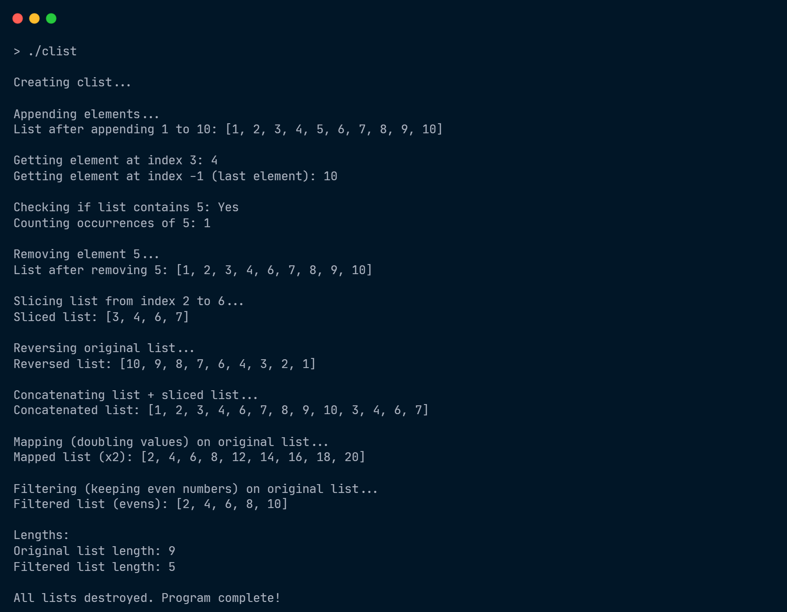

# List Implementation in C (clist)

This project provides a simple implementation of a dynamic list in C. It supports various list operations such as appending elements, slicing, mapping, filtering, and more.

## Files Included

- **`clist.c`**: Contains the implementation of the list's functionality.
- **`clist.h`**: The header file that declares the list's functions and structure.
- **`clist_err.c`**: Contains error handling functions for the list operations.
- **`clist_err.h`**: The header file that declares the error handling functions.

## Key Features

- **Append**: Adds elements to the end of the list.
- **Remove**: Removes a specified element from the list.
- **Get**: Retrieves an element by its index.
- **Contains**: Checks if an element exists in the list.
- **Count**: Returns the count of a specific element.
- **Slice**: Extracts a portion of the list as a new list.
- **Map**: Applies a function to every element in the list (e.g., doubling values).
- **Filter**: Filters elements based on a condition (e.g., keeping only even numbers).
- **Reverse**: Reverses the list.
- **Concatenate**: Combines two lists into one.

## Example Usage

Here's an example of how to use the `clist` in your program:

```c
#include "clist.h"
#include "clist_err.h"
#include <stdio.h>

int main() {
    // Create the list
    clist_t *list = create_clist();
    if (list == NULL) {
        printf("Error: %s\n", clist_err_msg(clist_error));
        return 1;
    }

    // Append elements
    for (int i = 1; i <= 5; i++) {
        append(list, i);
    }

    // Print the list
    print_clist(list);

    // Get an element at index
    printf("Element at index 2: %d\n", get(list, 2));

    // Remove an element
    remove_elem(list, 3);
    print_clist(list);

    // Clean up the list
    destroy_list(list);

    return 0;
}
```

## Functions Provided

### `clist.c`

- **`create_clist`**: Initializes and returns an empty list.
- **`destroy_list`**: Frees the memory allocated for the list.
- **`append`**: Adds an element to the end of the list.
- **`remove_elem`**: Removes an element from the list.
- **`get`**: Retrieves the element at a specified index.
- **`contains`**: Checks if an element is in the list.
- **`count`**: Counts occurrences of an element in the list.
- **`slice`**: Returns a sublist from a given range of indices.
- **`map`**: Applies a function to each element of the list.
- **`filter`**: Keeps only the elements that satisfy a given condition.
- **`reversed`**: Returns a new list with the elements in reverse order.
- **`concat`**: Concatenates two lists into one.

### `clist_err.c`

- **`clist_err_msg`**: Returns an error message based on the current error state.
  
## Error Handling

The `clist_err.c` file handles error messages for list operations. If an operation fails (for example, if an invalid index is provided), the error message can be retrieved using the `clist_err_msg` function. Errors are reported using an enum in `clist_err.h`.

## Compilation

To compile the code:

1. Make sure all the files (`clist.c`, `clist.h`, `clist_err.c`, `clist_err.h`) are in the same directory.
2. Use the following command to compile:
   ```bash
   gcc clist.c clist_err.c main.c -o clist
   ```

3. Run the program:
   ```bash
   ./clist
   ```

## Output (after running the `main.c` file)




## Future Enhancements

This project can be expanded with additional features, such as:

- Implementing more complex list operations (e.g., sorting, merging).
- Adding support for other data types beyond integers (e.g., strings, structs).
- Optimizing memory management and performance for large lists.
